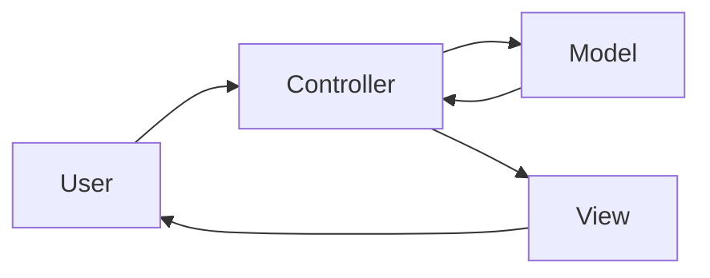

# trex_research
.NET Backend Geliştirme - Temel Bilgi ve Kavramlar Araştırma Raporu

# .NET Backend Geliştirme – Temel Bilgi ve Kavramlar

## 📌 İçindekiler
1. [Modern Yazılım Geliştirme Pratikleri](#1-modern-yazılım-geliştirme-pratikleri)
2. [.NET Ekosistemi](#2-net-ekosistemi)
3. [Backend Geliştirme Temelleri](#3-backend-geliştirme-temelleri)
4. [ASP.NET](#4-aspnet)
5. [Veritabanı ve ORM](#5-veritabanı-ve-orm)
6. [Güvenlik ve Performans](#6-güvenlik-ve-performans)
7. [Logging ve Hata Yönetimi](#7-logging-ve-hata-yönetimi)
8. [Yazılım Geliştirme Prensipleri](#8-yazılım-geliştirme-prensipleri)

## 1. Modern Yazılım Geliştirme Pratikleri

## Git ve GitHub

### Git Nedir?
- Yazılım projelerinde kullanılan bir **versiyon kontrol sistemidir**.  
- Projenin farklı sürümlerini kaydeder ve yönetir.  
- Yapılan değişiklikleri adım adım takip etmemizi sağlar.  
- Hatalı bir işlemde eski sürümlere dönmeyi kolaylaştırır.  
- Aynı proje üzerinde birden fazla kişinin eş zamanlı çalışmasına imkan tanır.  

Kısaca benim için **Git**, projeyi yerel bilgisayarımda güvenle yönetmemi sağlayan bir araçtır.  

---

### GitHub Nedir?
- Git ile yönetilen projelerin internet üzerinde saklandığı ve paylaşıldığı bir **platformdur**.  
- Git projeleri için bir **bulut deposu** gibi çalışır.  
- Kendi projelerimizi yedeklememizi ve istediğimiz yerden erişmemizi sağlar.  
- Ekip çalışmasını kolaylaştırır, farklı kişilerin katkı yapmasına olanak tanır.  
- Açık kaynak projelere katılım için en çok kullanılan platformlardan biridir.  

**GitHub’u**, projelerimi paylaşmak ve başkalarıyla iş birliği yapmak için en çok kullandığım araç olarak görebilirim.  

---
## Temel Git Komutları

## `git init`
- Bir klasörü Git deposuna dönüştürmek için kullanılır.  
- Projeyi ilk kez Git ile takip etmeye başlamanın yoludur.  

Benim için bu komut, **sıfırdan bir proje başlatırken ilk adımı atmak** gibidir.  


## `git clone`
- Var olan bir projeyi GitHub veya başka bir uzak depodan bilgisayara kopyalamayı sağlar.  
- Özellikle ekip çalışmalarında ortak projeyi kendi bilgisayarımıza indirmek için kullanılır.  
- Örneğin:  
-  `git clone repo-adresi` → ile bir arkadaşımın oluşturduğu depoyu kolayca bilgisayarıma çekebilirim.


## `git add`

Dosyalarda yapılan değişiklikleri **staging area (hazırlık alanı)**’na ekler.

- `git add dosya.txt` → belirli dosyayı ekler.  
- `git add .` → tüm değişiklikleri ekler.  

Bu aşama, commit öncesinde hangi değişikliklerin kaydedileceğini seçmemi sağlar.


#### → Staging Area Nedir?

Commit edilmeden önce dosyaların toplandığı **geçici alandır**.  

- Sadece staging area’ya eklenen dosyalar commit edilir.  
- Örneğin, 3 dosyadan sadece 2’sini `git add` ile staging area’ya alırsam commit sırasında yalnızca bu 2 dosya kaydedilir.  

 **Yani staging area, commit öncesi bir kontrol listesi gibidir.**


## `git commit`
Staging area’daki değişiklikleri **kalıcı olarak kaydeder**.  

- `git commit -m "mesaj"` → yapılan işlemi açıklayan bir mesaj yazılır.  

 Commit mesajları düzenli tutulduğunda, proje geçmişi çok daha anlaşılır olur.


## `git push`
Yerelde yapılan commit’leri **uzak depoya** (örneğin GitHub’a) gönderir.  

- Ekip çalışmasında kodun paylaşılmasını sağlar.  
- Push = *“Benim yaptıklarımı herkes görsün”* demektir.  


## `git pull`
Uzak depoda yapılan değişiklikleri bilgisayara indirir.  

- `git pull` ile başkalarının yaptığı güncellemeleri kendi koduma eklemiş olurum.  
- Projede güncel kalmak için en sık kullanılan komutlardan biridir.  


## `git branch`
Yeni bir dal (**branch**) oluşturur.  

- Farklı bir özellik üzerinde çalışırken ana projeyi bozmamak için kullanılır.  
- Örneğin: `git branch deneme` → “deneme” isimli yeni bir dal açar.  


## `git merge`
Bir branch’te yapılan değişiklikleri başka bir branch ile birleştirir.  

- Özellikle feature branch’ler tamamlandığında **main branch** ile merge edilir.  
- Bence bu, farklı yolların sonunda birleşim noktası gibidir.  

#### → Feature branch = yeni bir özellik geliştirme dalı.
Ana kodu bozmadan, güvenli şekilde geliştirme yapmayı sağlar.

#### Küçük Terminal Çıktısı Örneği

```bash
$ git init
Initialized empty Git repository

$ git add .

$ git commit -m "ilk commit"
[main] ilk commit
 1 file changed
```
---

## Merge Conflict Nedir, Nasıl Çözülür?

## Merge Conflict Nedir?
İki farklı dalda (**branch**) aynı dosyanın aynı satırlarında değişiklik yapılırsa **merge conflict** oluşur.  

- Git hangi değişikliğin doğru olduğunu kendi başına bilemez.  
- Bu yüzden bize sorar, biz karar verip düzenleriz.  

 **Basit Örnek:**  
- `main` branch’inde **index.html** dosyasına: `Merhaba Dünya` yazdım.  
- `login-feature` branch’inde aynı satırı: `Hello World` yaptım.  
- İkisini birleştirmeye çalıştığımda Git hangisini seçeceğini bilemez → merge conflict olur.  

---

## Merge Conflict Nasıl Çözülür?
Çakışan dosyayı açtığımda Git şu şekilde işaretler koyar:  

```bash
<<<<<<< HEAD
Merhaba Dünya
=======
Hello World
>>>>>>> login-feature
```
- Hangi kısmı tutacağıma **ben karar veririm**.  
- İster birini silerim, ister ikisini birleştiririm.  
- Düzelttikten sonra dosyayı kaydederim.  

Sonrasında Git’e bildiririm:  

```bash
git add index.html
git commit -m "Merge conflict çözüldü"
```

→ Özetle:
Merge conflict, Git’in karar veremediği bir çakışmadır.
Çözmek için dosyayı açıp hangisinin kalacağına biz karar veririz.

---
# CI/CD Nedir?

## CI (Continuous Integration – Sürekli Entegrasyon)
- Geliştiricilerin yaptığı kod değişikliklerinin **ortak depoya eklenmesidir**.  
- Kod her gönderildiğinde **otomatik testler** çalışır.  
- **Amaç:** Hataları erkenden görmek.  

---

## CD (Continuous Delivery / Deployment – Sürekli Teslim / Dağıtım)
- Testlerden geçen kodun **yayınlanmaya hazır hale gelmesidir**.  
- Gerekirse otomatik olarak **sunucuya aktarılır**.  
- **Amaç:** Kod her an **güncel ve çalışır** olsun.  

---

## Azure DevOps
- Microsoft’un geliştirdiği bir **CI/CD ve proje yönetim aracı**dır.  
- Kodlarımızı **test etmek, derlemek ve dağıtmak** için kullanılır.  
- Büyük projelerde **ekip çalışmasını kolaylaştırır**.  
#### Azure DevOps Pipeline Örneği

```yaml
trigger:
- main

pool:
  vmImage: 'ubuntu-latest'

steps:
- task: DotNetCoreCLI@2
  inputs:
    command: 'build'
    projects: '**/*.csproj'

- task: DotNetCoreCLI@2
  inputs:
    command: 'test'
    projects: '**/*Tests.csproj'
```
#### Açıklama

- `main` branch’e kod gönderildiğinde **pipeline otomatik tetiklenir**.  
- **Build adımı:** Projedeki tüm `.csproj` dosyaları derlenir.  
- **Test adımı:** Test projeleri (`*Tests.csproj`) çalıştırılır.  


## GitHub Actions

- GitHub’ın içinde gelen **otomatik işlem (automation) sistemidir**.  
- Kod her **push edildiğinde**:  
  - **Test** edebilir  
  - **Build** edebilir  
- **Kullanımı kolaydır** ve **hızlıdır**.
  
#### Örnek GitHub Actions Workflow

```yaml
name: .NET CI

on:
  push:
    branches: [ "main" ]

jobs:
  build:
    runs-on: ubuntu-latest
    steps:
    - uses: actions/checkout@v3
    
    - uses: actions/setup-dotnet@v3
      with:
        dotnet-version: '8.0.x'
    
    - run: dotnet build --configuration Release
    - run: dotnet test --no-build --verbosity normal
```
#### Açıklama

- **Trigger:** `main` branch’e push olduğunda çalışır.
- **Checkout:** Repo içeriği runner’a indirilir.
- **Setup .NET:** .NET 8.0 SDK yüklenir.
- **Build:** Proje Release modunda derlenir.
- **Test:** Testler çalıştırılır, ayrıntılı çıktı alınır.
  


## CI/CD – Azure DevOps ve GitHub Actions Karşılaştırması

| **Özellik**       | **Azure DevOps**                                      | **GitHub Actions**                                |
|--------------------|-------------------------------------------------------|--------------------------------------------------|
| **Kullanım Alanı** | Daha çok **büyük ekipler** ve **kurumsal projeler**   | Daha çok **bireysel** ve **küçük/orta projeler** |
| **Kurulum**        | İlk kurulum biraz daha **detaylıdır**                 | GitHub’da hazır, **çok hızlı başlar**            |
| **Esneklik**       | Çok kapsamlı ayarlar, ortamlar, onay adımları vardır  | Daha **basit** ve **hızlı** çalışır             |
| **Entegrasyon**    | **Azure ekosistemi** (Boards, Repos, vb.) ile uyumlu | Doğrudan **GitHub reposu** ile uyumlu           |
| **Avantaj**        | Profesyonel projelerde **detaylı kontrol** sağlar     | **Öğrenmesi ve kullanması daha kolay**           |

## Özet

- **CI** = Kod değişince **otomatik test**.  
- **CD** = Kodun **otomatik yayına alınması**.  
- **Azure DevOps** = Daha **kurumsal ve detaylı**.  
- **GitHub Actions** = Daha **basit ve hızlı**.

---

  ## Software Development Life Cycle (SDLC)

## SDLC Nedir?
- Yazılım geliştirme sürecinin adımlarını tanımlayan yöntemdir.  
- **Amaç:** Yazılımı planlı, düzenli ve hatasız şekilde geliştirmek.  


### SDLC Aşamaları

#### 1. Planlama
- Projenin amacı, kapsamı ve gereksinimleri belirlenir.  
- Zaman, maliyet ve ekip planı yapılır.  

#### 2. Analiz
- Kullanıcı ihtiyaçları toplanır.  
- Teknik gereksinimler çıkarılır.  

#### 3. Geliştirme (Coding)
- Yazılımcılar kodlama yapar.  
- Gereksinimlere uygun yazılım üretilir.  

#### 4. Test
- Yazılımda hatalar aranır ve düzeltilir.  
- Uygulamanın doğru çalışıp çalışmadığı kontrol edilir.  

#### 5. Dağıtım (Deployment)
- Yazılım kullanıcılara sunulur.  
- Ürün gerçek ortamda çalışmaya başlar.  

#### 6. Bakım (Maintenance)
- Hatalar düzeltilir, güncellemeler yapılır.  
- Yazılım yeni ihtiyaçlara göre geliştirilir.  


## Agile / Scrum / Kanban Metodolojileri

#### Agile
- Kısa döngülerle (**sprint**) hızlı geri bildirim alınarak geliştirme yapılır.  

#### Scrum
- Agile’ın en çok kullanılan çerçevesidir.  
- Roller: **Scrum Master, Product Owner, Team**  
- Günlük toplantılar (**daily scrum**) ve sprintlerle ilerler.  

#### Kanban
- İşlerin bir panoda kartlar halinde sıralanarak ilerlediği yöntemdir.  
- “**Yapılacaklar → Devam edenler → Tamamlananlar**” şeklinde görselleştirilir.  


## Yazılımcının Süreçteki Yeri
- **Planlama & Analiz:** Gereksinimleri anlamak için katkı sağlar.  
- **Geliştirme:** Kod yazar, veritabanı ve iş mantığını kurar.  
- **Test:** Hataları bulup düzeltir.  
- **Bakım:** Yazılımın sorunsuz çalışmaya devam etmesini sağlar.  

---

## 2. .NET Ekosistemi

## .NET Nedir?

## Tarihçesi
- **.NET**, Microsoft tarafından 2000’li yılların başında geliştirilmeye başlanmıştır.  
- İlk sürümü **2002’de** çıktı.  
- Başlangıçta sadece **Windows** için vardı, daha sonra **.NET Core** ile Linux ve macOS desteği geldi.  
- Günümüzde **.NET 5, .NET 6, .NET 7, .NET 8** sürümleriyle devam ediyor ve artık **platformdan bağımsız** çalışabiliyor.  


## Amacı
- Yazılımcıların farklı platformlarda (**Windows, web, mobil, bulut**) uygulama geliştirmesini kolaylaştırmak.  
- Tek bir çatı altında birden fazla programlama dilini desteklemek (**C#, F#, VB.NET**).  
- Hızlı, güvenli ve modern uygulamalar geliştirmeye imkan vermek.  


## Neden Kullanılır?
- **Çok platformlu:** Windows, Linux, macOS üzerinde çalışır.  
- **Geniş ekosistem:** Masaüstü, web, mobil, oyun (**Unity**), bulut uygulamaları geliştirilebilir.  
- **C# dili:** Öğrenmesi kolay, güçlü ve yaygın bir dildir.  
- **Performans:** Modern sürümlerde oldukça hızlıdır.  
- **Topluluk ve destek:** Microsoft ve geniş bir topluluk tarafından sürekli geliştirilir.  


 **Kısaca:**  
.NET, yazılım geliştirmeyi kolaylaştıran ve farklı ortamlarda kullanılabilen **güçlü bir platformdur**.  


## .NET Framework, .NET Core ve .NET 7/8+ Farkları

## .NET Framework
- **2002’de** çıktı, Microsoft tarafından geliştirildi.  
- Sadece **Windows** üzerinde çalışır.  
- **WinForms, WPF** gibi masaüstü uygulamaları için kullanılır.  
- Artık yeni özellikler eklenmiyor, sadece bakım yapılıyor.  


## .NET Core
- **2016’da** çıktı.  
- **Cross-platform** (Windows, Linux, macOS) desteği vardır.  
- **Açık kaynak** olarak geliştirildi.  
- Daha hızlı, hafif ve modern projeler için uygundur.  


## .NET 5/6/7/8+ (Güncel .NET)
- .NET Framework ve .NET Core birleşerek **tek platform** oldu.  
- Artık sadece **“.NET”** ismiyle devam ediyor.  
- **.NET 5 → 2020**, **.NET 6 → 2021 (LTS)**, **.NET 7 → 2022**, **.NET 8 → 2023 (LTS)**.  
- Hem Framework’ün gücünü hem Core’un hızını birleştiriyor.  
- Geniş destek alanları:  
  - Web (**ASP.NET**)  
  - Masaüstü (**WinForms, WPF**)  
  - Mobil (**Xamarin, MAUI**)  
  - Oyun (**Unity**)  
  - Bulut uygulamaları  


## Kıyaslama Tablosu

| **Özellik**       | **.NET Framework**        | **.NET Core**                   | **.NET 7/8+ (Güncel)**        |
|--------------------|---------------------------|----------------------------------|--------------------------------|
| **Çıkış Yılı**     | 2002                      | 2016                             | 2020 (5), 2021–2023 (6/7/8)   |
| **Çalıştığı Sistem** | Sadece Windows            | Windows, Linux, macOS            | Tüm platformlar                |
| **Açık Kaynak**    | Hayır                     | Evet                             | Evet                           |
| **Performans**     | Görece yavaş              | Daha hızlı, hafif                | En hızlı ve en güncel          |
| **Durum**          | Yeni geliştirme yok       | Destekleniyor                    | Gelecek bu platformda          |


 **Kısaca:**  
- **.NET Framework** → Eski, sadece Windows için.  
- **.NET Core** → Modern, açık kaynak ve platform bağımsız.  
- **.NET 7/8+** → Gelecek, hepsini birleştiren tek ve güncel .NET.  


## .NET Platformlar Arası Çalışabilir mi?

## .NET Framework
- Sadece **Windows** işletim sisteminde çalışır.  
- **Linux** ve **macOS** desteği yoktur.  


## .NET Core
- **Windows, Linux ve macOS** üzerinde çalışabilir.  
- Bu sayede aynı kod farklı sistemlerde kullanılabilir.  


## .NET 5/6/7/8+
- **Platformdan bağımsızdır**.  
- Tek bir .NET çatısı altında hem **Windows**, hem **Linux** hem de **macOS**’ta çalışır.  
- Ayrıca **mobil (Android, iOS)** ve **bulut uygulamaları** için de destek sunar.  


 **Özet:**  
Eski **.NET Framework** sadece Windows’a özel iken, **.NET Core** ile başlayan süreçte **.NET 7/8+** artık tamamen **cross-platform (çoklu platform)** hale gelmiştir.  

## Senkron ve Asenkron Programlama

## Senkron Programlama
- İşlemler **sıra ile** yapılır.  
- Bir işlem bitmeden diğeri başlamaz.  
- Basit projelerde uygundur fakat uzun süren işlemlerde programın **kilitlenmesine** neden olabilir.  


## Asenkron Programlama
- İşlemler aynı anda yürüyormuş gibi çalışır.  
- Uzun süren işlemler (**dosya okuma, veritabanı sorgusu, API çağrısı**) programı bekletmez.  
- Kullanıcı arayüzü **donmaz**, program daha **hızlı** ve **akıcı** çalışır.  


## Temel Kavramlar
- **async** → Bir metodun **asenkron** çalışacağını belirtir.  
- **await** → Asenkron işlemin bitmesini bekler ama programı **kilitlemez**.  
- **Task** → Bir işi temsil eden nesnedir. Asenkron metotlar genelde **Task** döner.  
- **ConfigureAwait(false)** → UI (arayüz) uygulamalarında, işlemin bitince aynı iş parçacığına dönüp dönmeyeceğini kontrol eder. Performans için kullanılır.  

##  Örnek: Asenkron Metot Kullanımı

```csharp
public async Task GetDataAsync()
{
    var data = await httpClient.GetStringAsync("https://example.com");
    Console.WriteLine(data);
}
```
- Burada **GetDataAsync** metodu veri indirirken programı kilitlemez.
- **await** ifadesi sayesinde veri indirilirken uygulama akışı donmaz.
- Kullanıcı arayüzü akıcı kalır, başka işlemler devam edebilir.

### Arrow Function (=>) C#’ta

- **Lambda ifadesi** olarak da bilinir.  
- Kısa ve okunabilir fonksiyon yazmak için kullanılır.  


##  Örnekler

### Normal yöntem
```csharp
int Square(int x)
{
    return x * x;
}
```
### Arrow function ile
```csharp
int Square(int x) => x * x;
```
### List filtreleme örneği
```csharp
var numbers = new List<int> {1, 2, 3, 4, 5};
var even = numbers.Where(n => n % 2 == 0);
````
- => ifadesi sayesinde tek satırda fonksiyonlar tanımlanabilir.
- Özellikle LINQ sorgularında çok sık kullanılır.

### Özet:

- Senkron = sırayla, bekletir.
- Asenkron = aynı anda, bekletmez.
- async/await, Task gibi yapılar asenkron programlamanın temelidir.
- Arrow function (=>) C#’ta kısa ve pratik kod yazmayı sağlar.


## Senkron ve Asenkron Programlama

## 1. Temel Farklar

| **Özellik**        | **Senkron Programlama**                       | **Asenkron Programlama**                          |
|---------------------|-----------------------------------------------|--------------------------------------------------|
| **Çalışma Şekli**   | İşlemler **sırayla** yapılır.                 | İşlemler **aynı anda yürüyormuş gibi** çalışır.  |
| **Bekleme**         | Bir işlem bitmeden diğeri başlamaz.           | Uzun süren işlem beklerken diğerleri devam eder. |
| **Kullanıcı Deneyimi** | Uzun işlemlerde program **donmuş gibi** olur. | Kullanıcı arayüzü **akıcı** kalır.               |
| **Performans**      | Basit ama **yavaş** olabilir.                 | Daha **hızlı** ve **verimli** çalışır.           |
| **Kullanım Alanı**  | Küçük ve kısa işlemler.                       | Dosya okuma, API çağrısı, veritabanı sorgusu gibi uzun işlemler. |

##  dotnet --info Örneği

 **Terminal çıktısı:**

```bash
$ dotnet --info
.NET SDK:
 Version:   8.0.100
 Commit:    abc123

Runtime Environment:
 OS Name:     Windows
 OS Version:  10.0.19045
 RID:         win10-x64

Host:
 Version:    8.0.0
 Architecture: x64
```
##  Yorum

- **SDK Version** → Yüklü .NET sürümü (**8.0.100**)  
- **OS Name/Version** → İşletim sistemi bilgisi (**Windows 10**)  
- **Architecture** → 64-bit çalıştığını gösterir  

 → Bu komut, hangi **.NET sürümüyle** geliştirme yaptığımızı öğrenmek için kullanılır.  

 ## Senkron / Asenkron Senaryo

## Senkron Senaryo
- Bir kafede kahve almak istiyorsun.  
- Kasaya gidiyorsun, sipariş veriyorsun.  
- Kasiyer hem kahveyi hazırlıyor hem de parayı alıyor.  
- Kahve hazır olmadan sıradaki müşteriyi almıyor.  
- Yani herkes **tek tek beklemek zorunda**.  

➡ Bu, **senkron programlama** gibidir: Bir işlem bitmeden diğeri başlamaz.  


## Asenkron Senaryo
- Aynı kafede başka bir durum düşün:  
- Kasada siparişini veriyorsun, ödemeyi yapıyorsun.  
- Kasiyer sana bir fiş veriyor ve sen kenarda beklerken başka müşterilere hizmet ediyor.  
- Barista kahveni hazırlıyor, hazır olunca adını sesleniyor ve alıyorsun.  
- Böylece hem sen beklerken boş durmuyorsun hem de kasada işler tıkanmıyor.  

➡ Bu da **asenkron programlama** gibidir: İşler aynı anda yürüyormuş gibi devam eder.  


##  Yazılım Açısından
- **Senkron →** Program bir işi yaparken diğerini **bekletir**.  
- **Asenkron →** Uzun süren iş arka planda devam ederken program **başka işleri de yapar**.

  ## C# Senkron Örnek

```csharp
// Senkron örnek
using System;
using System.Threading;

class Program
{
    static void Main()
    {
        Console.WriteLine("Dosya indiriliyor...");
        DownloadFile(); // Bu bitmeden aşağıya geçmez
        Console.WriteLine("İndirme tamamlandı.");
        Console.WriteLine("Program bitti.");
    }

    static void DownloadFile()
    {
        // 3 saniye dosya indiriyormuş gibi bekletelim
        Thread.Sleep(3000);
    }
}
```
 ➡ Burada Thread.Sleep dosya indiriyormuş gibi davranıyor.
Kod, indirme bitene kadar bekliyor.
Başka iş yapılmıyor, program bloklanıyor.

## C# Asenkron Örnek

```csharp
// Asenkron örnek
using System;
using System.Threading.Tasks;

class Program
{
    static async Task Main()
    {
        Console.WriteLine("Dosya indiriliyor...");
        var task = DownloadFileAsync(); // İndirme başladı ama bekletmiyor
        Console.WriteLine("Başka işler yapılabiliyor...");
        
        await task; // İndirme bitince devam eder
        Console.WriteLine("İndirme tamamlandı.");
        Console.WriteLine("Program bitti.");
    }

    static async Task DownloadFileAsync()
    {
        // 3 saniye dosya indiriyormuş gibi bekletelim
        await Task.Delay(3000);
    }
}
```
➡ Burada Task.Delay kullanıldı.

İndirme devam ederken program başka iş yapabiliyor.
Sonunda await ile indirme tamamlanıyor.
#### Özet
**Senkron:** Her şey sırayla → İndirme bitmeden başka iş olmaz.
**Asenkron:** İşler aynı anda yürüyormuş gibi → İndirme devam ederken başka işler yapılabilir.

---

## 3. Backend Geliştirme Temelleri

##  Backend Nedir?
- **Backend**, bir uygulamanın **arka planda çalışan kısmıdır**.  
- Kullanıcıların görmediği ama uygulamanın **asıl işlerini yapan taraftır**.  
- **Veritabanı işlemleri**, **kimlik doğrulama**, **iş mantığı (business logic)** burada gerçekleşir.  

 **Örnek:** Bir e-ticaret sitesinde ürün arama, sipariş oluşturma, ödeme alma işlemleri **backend** tarafından yapılır.  


## Frontend Nedir?
- **Frontend**, bir uygulamanın **kullanıcının gördüğü ve etkileşim kurduğu kısmıdır**.  
- Kullanıcı arayüzü (**UI**) tasarımı, butonlar, formlar, görseller bu tarafta bulunur.  
- **HTML, CSS, JavaScript** gibi teknolojilerle geliştirilir.  

 **Örnek:** E-ticaret sitesindeki ürün listesi, alışveriş sepeti ekranı, ödeme formu **frontend** kısmıdır.  


## Backend ve Frontend Farkları

| **Özellik**   | **Frontend (Kullanıcı Yüzü)**        | **Backend (Sunucu Tarafı)**          |
|---------------|---------------------------------------|---------------------------------------|
| **Görünürlük** | Kullanıcı tarafından görülür          | Kullanıcı görmez                      |
| **Teknolojiler** | HTML, CSS, JS, React, Angular        | C#, Java, Python, SQL                 |
| **Görev**     | Görselliği ve etkileşimi sağlar       | İş mantığı ve veri yönetimi           |
| **Örnek**     | Ürün kartı, buton, form               | Sepet hesaplama, ödeme işleme         |
| **Çalışma Yeri** | Tarayıcı / mobil uygulama            | Sunucu / veritabanı                   |


##  Basit Örnek Senaryo
- Bir kullanıcı web sitesinde **“Giriş Yap”** butonuna tıklar.  
- **Frontend:** Butona basıldığında form verilerini (**e-posta + şifre**) toplar.  
- **Backend:** Gelen verileri kontrol eder, doğruysa kullanıcıyı veritabanından doğrular ve giriş yapmasını sağlar.  


## Web Sunucusu ve API
###  Web Sunucusu Nedir?

**Tanım:**  
Web sunucusu, internet üzerinden gelen istekleri (**HTTP/HTTPS**) karşılayan ve istemcilere (tarayıcı, mobil uygulama vb.) cevap dönen bir yazılımdır.  

### Görevleri
- İstemciden gelen isteği alır (örn: `/index.html`).  
- İlgili içeriği bulur veya **backend**’e yönlendirir.  
- Cevabı istemciye geri gönderir.  

### Örnek Web Sunucuları
- **IIS (Internet Information Services):** Microsoft’un web sunucusu  
- **Apache HTTP Server:** En çok kullanılan açık kaynak sunucu  
- **Nginx:** Hafif ve performanslı sunucu  
- **Kestrel:** .NET Core projelerinde varsayılan sunucu  

 **Basitçe:** Web sunucusu, **istemci (frontend)** ile **uygulama (backend)** arasındaki **köprüdür**.  


###  API Nedir?

**Tanım:**  
**API (Application Programming Interface)**, yazılımların birbirleriyle iletişim kurmasını sağlayan **arayüzdür**.  

### Görevleri
- Bir uygulamanın sunduğu verileri veya işlevleri dış dünyaya açar.  
- İstemciler, API üzerinden bu verilere erişebilir veya işlem yapabilir.  

#### Örnek
- **Hava durumu API’si:** Kullanıcıya anlık hava bilgisi döner.  
- **Banka API’si:** Para transferi veya bakiye sorgulama yapılır.  

 **Kısacası:** API, **“uygulamalar arası köprü”** gibidir.  


##  API Türleri

### 1. REST (Representational State Transfer)
- **HTTP protokolü** kullanır.  
- Kaynaklara (`/users`, `/products`, `/orders`) URL üzerinden erişilir.  
- **JSON** veya **XML** ile veri taşır (**JSON daha yaygın**).  

📌 **Örnek:**  
```http
GET /users/1    → id=1 kullanıcısını getir
POST /users     → yeni kullanıcı ekle
  ````
### 2. SOAP (Simple Object Access Protocol)
- Daha **eski** ve **ağır** bir protokoldür.  
- **XML tabanlıdır.**  
- Daha çok **banka, sigorta** gibi güvenlik gerektiren sistemlerde tercih edilir.  
- Katı kurallara ve standartlara sahiptir.  


### 3. GraphQL
- **Facebook** tarafından geliştirilmiştir.  
- İstemci, yalnızca **ihtiyacı olan veriyi** isteyebilir.  
- Tek bir endpoint üzerinden çalışır (**/graphql**).  
- **JSON** ile veri döner.  

####  Örnek Sorgu:
```graphql
{
  user(id: 1) {
    name
    email
  }
}
```
➝ Sadece name ve email alanlarını döndürür.

###  Özet Tablo: REST vs SOAP vs GraphQL

| **Özellik**       | **REST**                    | **SOAP**                      | **GraphQL**                           |
|--------------------|-----------------------------|--------------------------------|----------------------------------------|
| **Veri Formatı**   | JSON / XML                  | XML                            | JSON                                   |
| **Hız**            | Hızlı ve hafif              | Yavaş (ağır XML)               | Daha hızlı, esnek                      |
| **Güvenlik**       | Orta (**HTTPS**)            | Yüksek (**WS-Security**)       | Orta (**JWT, HTTPS**)                  |
| **Kullanım Alanı** | Modern **web/mobil**        | **Banka, sigorta**             | **Büyük veri**, frontend odaklı        |
| **Endpoint Yapısı**| Çoklu (`/users`, `/products`)| Tek tip ama SOAP action        | Tek endpoint (`/graphql`)              |


## HTTP ve HTTP Metodları

### HTTP Nedir?

**HTTP (HyperText Transfer Protocol)**, web üzerindeki veri iletişimini sağlayan bir protokoldür.  
- **Tarayıcı** ile **sunucu** arasında **istek–cevap (request–response)** mantığıyla çalışır.  
- Örneğin, bir web sitesine girdiğimizde tarayıcı sunucuya *“sayfayı gönder”* der, sunucu da cevabı yollar.  


### HTTP Metodları

| **Metod** | **Açıklama**                  | **Basit Örnek**                                      |
|-----------|--------------------------------|------------------------------------------------------|
| **GET**   | Sunucudan veri alma           | Bir e-ticaret sitesinde **ürün listesini çekmek**    |
| **POST**  | Sunucuya yeni veri ekleme     | Kullanıcının **kayıt formu göndermesi**              |
| **PUT**   | Var olan veriyi güncelleme    | Kullanıcı **profil bilgilerinin değiştirilmesi**     |
| **DELETE**| Veriyi silme                  | Bir ürünün **sepetten çıkarılması**                  |

#### HTTP Metodları ve Örnekleri  

##### 1. GET – Veri çekmek  
**Amaç:** Sunucudan bilgi almak.  

 **Örnek Senaryo:**  
Menüdeki kahveleri görmek istiyoruz.  

```http
GET /api/kahveler
```

➡ Sunucu bize JSON formatında tüm kahvelerin listesini döner.

##### 2. POST – Yeni veri eklemek  

**Amaç:** Sunucuya yeni bir kayıt eklemek.  

 **Örnek Senaryo:**  
Filtre kahve siparişi veriyoruz.  

```http
POST /api/siparisler
````

Body (gönderilen veri):

```json
{
  "urun": "Filtre Kahve",
  "adet": 2,
  "boyut": "Grande"
}
```
➡ Sunucu yeni siparişi oluşturur ve bize sipariş numarası döner.

##### 3. PUT – Var olan veriyi güncellemek  

**Amaç:** Mevcut bir kaydı tamamen değiştirmek.  

 **Örnek Senaryo:**  
Sipariş verdiğimiz kahveyi **küçük boy** yapmaya karar verdik.  

```http
PUT /api/siparisler/123
```

Body:

```json
{
  "urun": "Filtre Kahve",
  "adet": 2,
  "boyut": "Tall"
}
```
➡ Sipariş 123 artık küçük boy kahve ile güncellenir.

##### 4. DELETE – Veri silmek  

**Amaç:** Var olan bir kaydı silmek.  

 **Örnek Senaryo:**  
Siparişi iptal etmek istiyoruz.  

```http
DELETE /api/siparisler/123
```
➡ Sunucu siparişi siler ve şu yanıtı döner: "mesaj": "Sipariş iptal edildi"

## RESTful Servislerin Çalışma Mantığı

**REST (Representational State Transfer)**, web servislerinin nasıl tasarlanacağını belirleyen bir prensiptir.  

### Mantığı
- **Kaynaklar (resources)** vardır → örnek: **kullanıcılar, ürünler, siparişler**  
- Bu kaynaklara **URL üzerinden** erişilir → `https://api.site.com/users/1`  
- Her işlem için **HTTP metodları** kullanılır: **GET, POST, PUT, DELETE**  


###  Küçük Senaryo: “Alışveriş Sitesi”

```http
GET /products      → Tüm ürünleri getir
GET /products/5    → ID’si 5 olan ürünü getir
POST /products     → Yeni ürün ekle
PUT /products/5    → 5 numaralı ürünü güncelle
DELETE /products/5 → 5 numaralı ürünü sil
```
- Görüldüğü gibi, URL’de sadece kaynak adı olur.
- Ne yapılacağına HTTP metodu karar verir.

#### REST’in Avantajları
- Basit ve anlaşılırdır.
- Her platformdan (C#, Java, Python, JavaScript vb.) kolayca kullanılabilir.
- JSON formatı ile çalıştığı için hafif ve hızlıdır.

### RESTful Servislerin Çalışma Mantığı



## JSON Veri Formatı ve Kullanım Amacı

- **JSON (JavaScript Object Notation)**, veri saklamak ve taşımak için kullanılan çok basit bir formattır.  
- **İnsanların okuması kolaydır**, aynı zamanda bilgisayarlar da rahatça anlayıp işleyebilir.  
- Özellikle **istemci (frontend)** ile **sunucu (backend)** arasında veri alışverişinde en çok tercih edilen formattır.  
- Veriler **anahtar : değer (key : value)** şeklinde tutulur.
  

#### Örnek JSON Verisi

```json
{
  "siparisId": 12345,
  "urun": {
    "ad": "Filtre Kahve",
    "boyut": "Orta Boy",
    "sicaklik": "Soguk",
    "süt": false
  },
  "fiyat": 45.00,
  "adet": 2,
  "toplamTutar": 90.00,
  "musteri": {
    "ad": "Feyza",
    "odemeYontemi": "Kredi Kartı"
  },
  "hazirMi": false
}
```
#### Açıklama

- **"siparisId": 12345** → Siparişin kimlik numarası.  
- **"urun": {...}** → İç içe nesne, ürünün detaylarını tutuyor.  
  - **"ad": "Filtre Kahve"** → Sipariş edilen ürün.  
  - **"boyut": "Orta Boy"** → Kahvenin boyutu.  
  - **"sicaklik": "Soguk"** → Kahvenin sıcak mı soğuk mu olacağı.  
  - **"süt": false** → Sütsüz kahve seçilmiş.  
- **"fiyat": 45.00** → Bir kahvenin fiyatı.  
- **"adet": 2** → Kaç tane kahve sipariş edildiğini belirtir.  
- **"toplamTutar": 90.00** → İki kahve için toplam ücret.  
- **"musteri": {...}** → Müşteri bilgilerini içerir.  
  - **"ad": "Feyza"** → Siparişi veren kişi.  
  - **"odemeYontemi": "Kredi Kartı"** → Ödeme şekli.  
- **"hazirMi": false** → Sipariş hazır mı? (**Henüz hazırlanıyor**).

  👉 Bu örnekle, API’ye `/api/siparis/12345` şeklinde sorgu attığında sistem sana bu **JSON** çıktısını dönebilir.  

 Aynı yapıyı, bir **kahve zincirinin mobil uygulamasında sipariş takibi** için düşünebilirsin.  
Kullanıcı uygulamadan siparişini görüntüler, backend de bu JSON verisini döndürerek **sipariş detaylarını** sağlar.  

## SOAP ve GraphQL Nedir, REST’ten Farkları

###  SOAP (Simple Object Access Protocol)
- **XML tabanlı** bir iletişim protokolüdür.  
- Daha **katı kurallara** sahiptir (standart yapılar, güvenlik ekleri vs.).  
- Özellikle **bankacılık, finans, telekom** gibi güvenliğin çok önemli olduğu yerlerde tercih edilir.  
- Daha **ağırdır**, öğrenmesi ve kullanması **REST’e göre zordur**.  

 **Benim için:** SOAP bana biraz *“eski usul ama güvenli”* sistemleri hatırlatıyor.  


###  GraphQL
- **Facebook** tarafından geliştirilmiş bir **sorgulama dili**dir.  
- İstemci sadece **ihtiyacı olan veriyi** ister, fazlası gelmez.  
- Tek bir **endpoint** üzerinden çalışır (REST’te olduğu gibi farklı endpointlere gerek kalmaz).  
- Daha **esnek** ve **performanslıdır**, ama öğrenme eğrisi **REST’e göre biraz daha zordur**.  

 **Benim için:** GraphQL bana *“menüden sadece istediğini seçip almak”* gibi geliyor.  


## REST vs SOAP vs GraphQL Karşılaştırma


| Özellik          | REST                        | SOAP                     | GraphQL                               |
|------------------|-----------------------------|--------------------------|---------------------------------------|
| **Veri formatı** | JSON (çoğunlukla)           | XML                      | JSON                                  |
| **Esneklik**     | Orta (endpointlere bağlı)   | Düşük (çok katı)         | Yüksek (tam istenilen veri gelir)     |
| **Kullanım alanı** | Genel web servisleri        | Bankacılık, güvenlik odaklı | Modern web & mobil uygulamalar        |
| **Öğrenme kolaylığı** | Kolay                      | Zor                      | Orta                                  |
| **Performans**   | Genelde iyi                 | Ağır                     | Daha hızlı (fazla veri gelmez)        |

---

## 4. ASP.NET

### ASP.NET ve ASP.NET Core

### ASP.NET Nedir?
- Microsoft tarafından geliştirilen web uygulama geliştirme teknolojisidir.  
- İlk kez **.NET Framework** ile birlikte çıktı (2002).  
- Genelde **Windows** işletim sistemi üzerinde çalışır.  
- **Web Forms, MVC, Web API** gibi farklı geliştirme modellerini destekler.  

###  ASP.NET Core Nedir?
- ASP.NET’in modern, yeniden yazılmış sürümüdür (**2016’da çıktı**).  
- **Platform bağımsızdır** → Windows, Linux, macOS üzerinde çalışır.  
- Daha **hafif, hızlı** ve **bulut uyumlu** olacak şekilde tasarlanmıştır.  
- **Açık kaynaklıdır**, GitHub üzerinde sürekli geliştirilmektedir.  

###  Avantajlar
####  ASP.NET
- Windows ve IIS ile güçlü entegrasyon  
- Uzun süredir kullanılan, köklü teknoloji  
- .NET Framework ekosistemiyle uyumlu  

####  ASP.NET Core
- **Platform bağımsız** (Windows, Linux, macOS)  
- Daha **yüksek performans**  
- **Mikroservis, bulut, container (Docker/Kubernetes)** desteği  
- **Açık kaynak** → sürekli güncel kalıyor  


###  ASP.NET ve ASP.NET Core Farkları

| Özellik        | ASP.NET (Framework)         | ASP.NET Core                  |
|----------------|-----------------------------|--------------------------------|
| **Çıkış Yılı** | 2002                        | 2016                          |
| **Çalışma Ortamı** | Sadece **Windows**        | **Windows, Linux, macOS**     |
| **Performans** | Daha **ağır**               | Daha **hafif ve hızlı**       |
| **Açık Kaynak** | ❌ Hayır                   | ✅ Evet                       |
| **Modern Kullanım** | Az (eski projelerde var) | Çok (yeni projelerde tercih ediliyor) |

 **Benim Yorumum:**  
ASP.NET bana **“eski ama sağlam bir araba” 🚗** gibi geliyor,  
ASP.NET Core ise **“yeni nesil elektrikli araba” ⚡** gibi → daha hızlı, esnek ve geleceğe uygun.

##  MVC Nedir, Ne İçin Kullanılır?

###  MVC Nedir?
**MVC (Model – View – Controller)** yazılım geliştirmede kullanılan bir **mimari desen**dir.  
Uygulamayı **3 farklı katmana** ayırır:

- **Model** → Veriler ve iş mantığı  
  *(ör. veritabanındaki ürün bilgileri)*  
- **View** → Kullanıcıya görünen arayüz  
  *(ör. ürünleri listeleyen sayfa)*  
- **Controller** → Kullanıcıdan gelen istekleri alır, uygun modeli çağırır, sonucu doğru görünüme gönderir  


###  Neden Kullanılır?
- ✅ Kodun **düzenli** olmasını sağlar (her şey tek yerde değil, parçalı yapı).  
- ✅ **Bakım** ve geliştirme kolaydır (sadece ilgili katmanı değiştirirsin).  
- ✅ **Ekip çalışmasına** uygundur (Frontend geliştirici → View, Backend geliştirici → Controller/Model).  
- ✅ **Tekrar kullanılabilir** kod yazmayı kolaylaştırır.  


###  Küçük Bir Örnek
Bir **alışveriş sitesi** için:

- **Model** → `Product` tablosu → *ürün adı, fiyatı, stok bilgisi*  
- **View** → “Ürünler” sayfasında listelenen ürünler  
- **Controller** → Kullanıcı “Ürünleri Görüntüle” dediğinde veritabanından ürünleri alır ve sayfaya gönderir  


 **Kısaca:**  
**MVC = Düzen + Ayrım + Kolay geliştirme**  

 Benim için MVC, *“her şeyi yerli yerine koyan bir dolap düzeni”* gibi.  
Dağınık değil, aradığını kolay buluyorsun.


##  Middleware Nedir, Nasıl Çalışır?

###  Middleware Nedir?
**Middleware**, ASP.NET Core uygulamalarında **istek (request)** ile **yanıt (response)** arasına giren yazılım parçalarıdır.  
Bir web uygulamasına gelen her istek, bir **middleware zincirinden (pipeline)** geçer.

Her middleware iki şey yapabilir:
1.  **Kendi görevini yerine getirmek** (ör: log tutmak, güvenlik kontrolü yapmak).  
2.  **Sonraki middleware’e aktarmak**.  


###  Çalışma Mantığı
1.  **İstemciden bir HTTP isteği gelir.**  
2.  İstek **pipeline (boru hattı)** boyunca middleware’lerden geçer.  
3.  Her middleware işlemini yapar → sonra isteği sıradaki middleware’e gönderir.  
4.  En son **response (yanıt)** üretilir ve aynı zincir üzerinden geri döner.  


###  Basit Bir Örnek
ASP.NET Core `Startup.cs` içinde middleware tanımlama:

```csharp
public void Configure(IApplicationBuilder app)
{
    app.Use(async (context, next) =>
    {
        Console.WriteLine("👉 İstek geldi");
        await next(); // bir sonraki middleware’e aktar
        Console.WriteLine("👈 Yanıt döndü");
    });

    app.Run(async context =>
    {
        await context.Response.WriteAsync("Merhaba Middleware!");
    });
}
```
➡ Bu örnekte:
- İlk middleware isteği yakalar, log yazar.
- **next()** ile diğer middleware’e yollar.
- Son middleware yanıtı üretir.
- Ardından zincir geri dönüp log yazmaya devam eder.

➡ Benim Yorumum:
- Middleware bana “güvenlik kapılarından geçip ofise ulaşmak” gibi geliyor.
- Her kapı (middleware) kontrol yapıyor → en sonunda içeri (response) ulaşıyorsun.

  
## Middleware Örneği

```csharp
public void Configure(IApplicationBuilder app)
{
    // 1️⃣ İlk middleware → Request console'a yazdırılır
    app.Use(async (context, next) =>
    {
        Console.WriteLine("İstek alındı: " + context.Request.Path);
        await next(); // isteği sonraki middleware'e gönder
    });

    // 2️⃣ Son middleware → Yanıt döner
    app.Run(async context =>
    {
        await context.Response.WriteAsync("Merhaba Dünya!");
    });
}
```
##### Açıklama

İlk middleware: Gelen HTTP isteğini yakalayıp konsola logluyor.
next() çağrısı ile kontrolü bir sonraki middleware’e aktarıyor.
İkinci middleware: Kullanıcıya "Merhaba Dünya!" cevabını döndürüyor.

##### Kısaca

Middleware = İstek–Yanıt yolundaki kontrol noktalarıdır.

Bu kontrol noktalarında şu işler yapılabilir:
✅ Loglama
✅ Kimlik doğrulama (Authentication)
✅ Hata yönetimi (Exception Handling)
✅ Yetkilendirme (Authorization)
✅ Caching, Routing, Response formatting...

 Yani middleware zinciri, aslında istek ile yanıt arasındaki ince filtreler gibidir.
Her istek bu filtrelerden geçer, her filtre isterse:
- Kendi işini yapar
- Ya da isteği bir sonrakine paslar.

  
## Dependency Injection (DI) Nedir, Neden Önemlidir?

###  DI Nedir?
**Dependency Injection (DI)**, bir sınıfın ihtiyaç duyduğu nesneleri kendi içinde **oluşturmak** yerine **dışarıdan almasıdır**.  
Yani `new` anahtar kelimesi ile bağımlılık yaratmak yerine, ihtiyacımız olan nesneyi dışarıdan **enjekte ederiz**.


###  Neden Önemlidir?

-  **Bağımlılıkları azaltır** → Sınıflar birbirine sıkı sıkıya bağlı olmaz.  
-  **Test etmeyi kolaylaştırır** → Mock/Fake nesneler enjekte edilerek kolayca test yapılabilir.  
-  **Esneklik sağlar** → İstediğimiz yerde farklı implementasyonları kullanabiliriz.  
-  **Bakımı kolaydır** → Kod daha temiz, modüler ve anlaşılır olur.  


###  Küçük Bir Örnek (C#)

**Kötü Kullanım (Bağımlılık içeride oluşturuluyor):**
```csharp
public class OrderService
{
    private SqlRepository _repo = new SqlRepository(); // new ile bağımlılık

    public void CreateOrder(string product)
    {
        _repo.Save(product);
    }
}
```
- Burada ProductService, ProductRepository’e sıkı sıkıya bağlı.
- Başka bir repository kullanmak istesek kodu değiştirmemiz gerekir.

  
**Doğru Kullanım (DI ile dışarıdan veriliyor)**

```csharp
public class OrderService
{
    private readonly IRepository _repo;

    public OrderService(IRepository repo) // dışarıdan enjekte ediliyor
    {
        _repo = repo;
    }

    public void CreateOrder(string product)
    {
        _repo.Save(product);
    }
}
```
#### ASP.NET Core’da bu bağımlılıkları DI Container’a ekleriz:

- services.AddScoped<IProductRepository, ProductRepository>();
- services.AddScoped<ProductService>();

#### Kısaca
- DI = bağımlılıkları dışarıdan almak
- Daha esnek, test edilebilir ve bakımı kolay bir yapı sağlar

  ---

## Katmanlı Mimari (Layered Architecture)

Katmanlı mimari, uygulamayı **katmanlara ayırarak** geliştirme yapmamızı sağlar.  
Böylece kod **daha düzenli, bakımı kolay ve test edilebilir** olur.


### 1️ Presentation Layer (Sunum Katmanı)
- Kullanıcı ile etkileşimin olduğu katmandır.  
- **Örn:** ASP.NET MVC Controller, Razor Pages, WinForms, Blazor UI  
- Görevi sadece **görüntülemek ve kullanıcıdan veri almak**.  
-  İş mantığı burada yazılmaz!  


### 2️ Business Layer (İş Katmanı)
- İş kurallarının yazıldığı katmandır.  
- **Örn:** “Bir hayvan 10 yaşına gelince ölür.” gibi kurallar burada olur.  
- **Service** sınıfları bu katmanda yer alır.  
- Presentation’dan gelen istekleri alır ve **Data Access Layer** ile konuşur.  


### 3️ Data Access Layer (Veri Erişim Katmanı)
- Veritabanı ile etkileşimi sağlar.  
- **Örn:** Entity Framework, ADO.NET, Dapper  
- Burada sadece **CRUD (Create, Read, Update, Delete)** işlemleri yapılır.  
- Genelde **Repository Pattern** burada uygulanır.  


 **Kısaca:**  
Katmanlı mimari = **Düzen + Ayrım + Bakım kolaylığı**.  
Her katman kendi işini yapar → Kod karışmaz, geliştirmek kolaylaşır.  


## Service & Repository Pattern

### Repository Pattern
Veritabanı işlemlerini soyutlamak için kullanılır.

Yani DbContext ya da SQL kodlarını Presentation veya Business katmanına taşımayız.

Örn: `IProductRepository` → `Add()`, `GetAll()`, `Delete()` metotları


```csharp
public interface IProductRepository
{
    void Add(Product product);
    IEnumerable<Product> GetAll();
}

public class ProductRepository : IProductRepository
{
    private readonly AppDbContext _context;
    public ProductRepository(AppDbContext context)
    {
        _context = context;
    }

    public void Add(Product product)
    {
        _context.Products.Add(product);
        _context.SaveChanges();
    }

    public IEnumerable<Product> GetAll()
    {
        return _context.Products.ToList();
    }
}
```
### Service Pattern

İş kurallarını barındırır.

Repository’den aldığı veriler üzerinde kurallar uygular.

```csharp
public class ProductService
{
    private readonly IProductRepository _repository;

    public ProductService(IProductRepository repository)
    {
        _repository = repository;
    }

    public void CreateProduct(string name, decimal price)
    {
        if (price <= 0)
            throw new Exception("Fiyat 0 veya negatif olamaz!");

        var product = new Product { Name = name, Price = price };
        _repository.Add(product);
    }
}
```
### Katmanların Birlikte Çalışması

```mermaid
flowchart TD
    User[" Kullanıcı"] --> Presentation[" Presentation Layer"]
    Presentation --> Service[" Business Layer (Service)"]
    Service --> Repository[" Data Access Layer (Repository)"]
    Repository --> Database[" Database"]

```



   ### Kısaca

- **Presentation** → Sadece kullanıcı ile iletişim kurar.  
- **Business (Service)** → İş kuralları burada.  
- **Data Access (Repository)** → Veritabanı işlemleri burada.  

 Benim için katmanlı mimari, bir restoran mutfağı gibi :  
- **Garson (Presentation)** sipariş alır.  
- **Aşçı (Business)** yemeği hazırlar.  
- **Malzeme sorumlusu (Data Access)** depodan ürünleri getirir.
  
---

  ## Clean Architecture

**Clean Architecture**, yazılım projelerinde bağımlılıkları doğru yönetmek için kullanılan bir mimaridir.  

**Amaç:**
- Esnek (kolay değiştirilebilir)  
- Test edilebilir  
- Uzun ömürlü yazılım geliştirmek  

Temel fikir şu: İş kuralları (**domain**) en merkezde olur ve dış katmanlara bağımlı olmaz.  
Bağımlılıklar dıştan içe değil, **dıştan içe akar**.  


## Katmanlar

### 1️ Domain Layer (Merkez – Kalp)
- Uygulamanın en önemli kısmı → iş kuralları burada.  
- Entity’ler, Value Object’ler, kurallar, interface’ler bulunur.  
- Hiçbir şeye bağımlı değildir (veritabanı, UI, framework).  

### 2️ Application Layer
- Domain ile dış dünya arasındaki köprü.  
- Use Case’ler burada yazılır.  
- Örn: “Sipariş oluşturma”, “Para transferi yapma” gibi senaryolar.  
- Repository ve Service interface’lerini çağırır ama onların implementasyonunu bilmez.  

### 3️ Infrastructure Layer
- Uygulamanın teknik detayları burada olur:  
  - Entity Framework / Dapper  
  - Mail servisleri  
  - Dosya sistemi  
- Application/Domain’de tanımlanan interface’lerin gerçek implementasyonu burada yapılır.  

### 4️ API (Presentation Layer)
- Kullanıcıyla etkileşim kuran katman.  
- Örn: ASP.NET Core Web API Controller.  
- Sadece Application katmanındaki Use Case’leri çağırır.  


## Bağımlılıkların Dışa Akması İlkesi

Clean Architecture’ın en önemli kuralı:  
➡ **Merkezdeki katmanlar dıştaki katmanlara bağımlı olamaz.**  
➡ Ama dıştaki katmanlar içtekilere bağımlıdır.  

Yani:  
- **Domain** → hiçbir katmana bağımlı değil  
- **Application** → sadece Domain’e bağımlı  
- **Infrastructure & API** → Application ve Domain’e bağımlı

```mermaid
flowchart TD
    Domain[ Domain Layer] <--> Application[ Application Layer]
    Application --> Infrastructure[ Infrastructure Layer]
    Application --> API[ API Layer]
    Infrastructure --> Database[( Database)]
    API --> User[ Kullanıcı]
```
  

    
### Küçük Örnek

- **Domain:** `Order` entity → “sipariş tutarı 0’dan küçük olamaz” kuralı  
- **Application:** `CreateOrderHandler` → sipariş oluşturma use case’i  
- **Infrastructure:** `OrderRepository` → EF Core ile veritabanına kaydeder  
- **API:** `OrderController` → HTTP POST isteğini alır, Application’a yollar  


#### Benim Yorumum
- Clean Architecture bana **soğan katmanlarını ** hatırlatıyor.  
- En içte özü (**iş kuralları**) koruyoruz.  
- Dış katmanlar (UI, DB, Framework) değişse bile içteki kurallar bozulmuyor.  

## Middleware Sıralaması (Startup.cs / Program.cs)

ASP.NET Core’da gelen her istek, tanımladığımız **middleware zincirinden sırayla geçer**.  
Bu yüzden **middleware’lerin sırası çok önemlidir**.  
Yanlış yerde tanımlarsak uygulama beklediğimiz gibi çalışmaz.

```csharp
var builder = WebApplication.CreateBuilder(args);
var app = builder.Build();

// 1️⃣ Hata yakalama
app.UseExceptionHandler("/Home/Error");

// 2️⃣ HTTPS yönlendirmesi
app.UseHttpsRedirection();

// 3️⃣ Statik dosyalar (wwwroot)
app.UseStaticFiles();

// 4️⃣ Routing (yönlendirme için temel ayar)
app.UseRouting();

// 5️⃣ Authentication → Kimlik doğrulama
app.UseAuthentication();

// 6️⃣ Authorization → Yetkilendirme
app.UseAuthorization();

// 7️⃣ Endpoint (Controller action’ları çalışır)
app.MapControllerRoute(
    name: "default",
    pattern: "{controller=Home}/{action=Index}/{id?}");

app.Run();
```
## Sıralamanın Mantığı

- **ExceptionHandler** → En başta olmalı ki diğerlerinde hata olursa yakalayabilsin.  
- **HttpsRedirection** → İstek daha baştan HTTPS’e yönlendirilmeli.  
- **StaticFiles** → Kullanıcı resim, CSS, JS gibi dosyalara direkt erişebilmeli.  
- **Routing** → Controller/action’ların hangi isteğe karşılık geleceğini belirler.  
- **Authentication → Authorization** → Önce kim olduğunu öğren (login), sonra yetkisi var mı diye kontrol et.  
- **Endpoints** → En sonda, çünkü artık tüm hazırlıklar tamam → isteği ilgili Controller’a gönder.  


## Kısaca Benim Yorumum

Middleware sırası bana **havaalanı güvenlik sürecini** hatırlatıyor :  

1. X-ray’den geç (**ExceptionHandler = kontrol noktası**)  
2. Pasaportun kontrol edilir (**Authentication**)  
3. Boarding pass kontrolü (**Authorization**)  
4. Uçağa binersin (**Endpoint**)  

➡ Yanlış sırada olsa, yolculuk bozulur.

---

## 5. Veritabanı ve ORM

## SQL Nedir?

**SQL (Structured Query Language)** veritabanlarıyla konuşmak için kullandığımız bir dildir.  
Aslında veritabanı bizim için büyük bir **defter** gibi düşünülebilir.  

SQL sayesinde bu deftere:

-  **Yeni bilgi ekleriz** → `INSERT`  
-  **Var olan bilgiyi okuruz** → `SELECT`  
-  **Bilgiyi güncelleriz** → `UPDATE`  
-  **Bilgiyi sileriz** → `DELETE`  


### Örnek
Okul defterinde öğrencilerin listesi var.  
Ben şu SQL sorgusunu yazarsam:

```sql
SELECT * FROM Students;

```
Bana defterdeki tüm öğrencileri göster” demiş olurum.

**Kısaca:** SQL, veritabanıyla soru-cevap yapmamızı sağlayan ortak bir dil.


## İlişkisel ve İlişkisel Olmayan Veritabanları Arasındaki Farklar


###  İlişkisel Veritabanı (Relational Database – RDBMS)
- Veriler **tablolar halinde** tutulur (Excel sayfası gibi düşünebilirsin).  
- Tablolar birbirine **ilişkiler** ile bağlanır.  
- **Örnek:** `Students` tablosu ve `Courses` tablosu → öğrenci hangi derse kayıtlı ilişkisi.  
- Kullanılan dil: **SQL**  
- **Örnekler:** SQL Server, MySQL, PostgreSQL, Oracle  


###  İlişkisel Olmayan Veritabanı (NoSQL Database)
- Veri yapısı **tablo olmak zorunda değildir** → JSON, key-value, graph, document gibi farklı formatlarda saklanabilir.  
- Daha **esnek**, özellikle **büyük veriler** ve **hızlı ölçeklenme** gereken durumlarda kullanılır.  
- **Örnek kullanım:** Sosyal medya gönderileri, sensör verileri.  
- **Örnekler:** MongoDB, Cassandra, Redis, CouchDB  


###  Basit Bir Benzetme
- **İlişkisel DB** → Düzenli bir **klasör dolabı** gibi. Her şey tablolara ayrılmış, kurallı.  
- **NoSQL DB** → Daha özgür bir **kutu** gibi. İçine ister dosya, ister resim, ister JSON atabilirsin.  


 **Kısaca:**  
- Düzenli ve ilişkili veri → **İlişkisel DB**  
- Esnek, hızlı ve farklı formatlarda veri → **İlişkisel olmayan DB**


## ORM Nedir? Entity Framework Core Nedir?


###  ORM (Object Relational Mapping)
- ORM, veritabanı ile çalışırken **SQL sorguları yazmak yerine nesnelerle (class/objeler) işlem yapmamızı** sağlayan bir tekniktir.  
- Yani tabloları **C# sınıfları** gibi düşünebilirim.  
- **Avantajı:** Daha az kod, daha okunabilir ve bakımı kolay bir yapı.  
- **Örnek:**  
  `Student` tablosu için C#’ta `Student` sınıfı oluşturup doğrudan `student.Name` gibi erişebilirim.  


###  Entity Framework Core (EF Core)
- Microsoft’un geliştirdiği, **.NET projelerinde kullanılan popüler ORM aracıdır.**  
- SQL yazmadan sadece **C# kodlarıyla** veritabanında işlem yapabilirim.  
- Hem **Code-First** (önce kod → veritabanı oluşur) hem de **Database-First** (önce veritabanı → kod üretilir) yaklaşımlarını destekler.  
- **Cross-platform** (Windows, Linux, macOS) çalışır.  

#### Küçük Bir Örnek

```csharp
// Model
public class Student
{
    public int Id { get; set; }
    public string Name { get; set; }
}

// DbContext
public class SchoolContext : DbContext
{
    public DbSet<Student> Students { get; set; }
}
```
➡ Bu kod ile EF Core, Students adında bir tabloyu veritabanında otomatik oluşturur.
➡ Ben context.Students.Add(new Student { Name = "Ali" }) dediğimde SQL’de şu sorgu çalışmış olur:

```sql
INSERT INTO Students (Name) VALUES ('Ali')
```

**Kısaca:**
ORM → Veritabanıyla nesneler üzerinden çalışmayı sağlayan teknoloji.
EF Core → .NET projelerinde kullanılan Microsoft’un ORM aracıdır.


## DbContext Nedir, Nasıl Kullanılır?

 **DbContext**, Entity Framework Core’da veritabanı ile uygulama arasındaki köprü gibidir.  

- Tabloları **DbSet** koleksiyonları olarak tutar.  
- Veritabanına bağlanmayı, sorgu yapmayı ve değişiklikleri kaydetmeyi sağlar.  


#### Nasıl Kullanılır?

### DbContext sınıfı oluşturulur:
```csharp
public class SchoolContext : DbContext
{
    public DbSet<Student> Students { get; set; }

    protected override void OnConfiguring(DbContextOptionsBuilder optionsBuilder)
    {
        optionsBuilder.UseSqlServer("Server=.;Database=SchoolDB;Trusted_Connection=True;");
    }
}
```
#### Veri ekleme:

```csharp
using (var context = new SchoolContext())
{
    context.Students.Add(new Student { Name = "Ayşe" });
    context.SaveChanges(); // SQL INSERT çalışır
}
```

#### Veri çekme:

```csharp
using (var context = new SchoolContext())
{
    var students = context.Students.ToList(); // SQL SELECT çalışır
}
```

 **Kısaca:**
DbContext = Veritabanı yöneticisi
DbSet = Tablolar
SaveChanges() = Yapılan değişiklikleri veritabanına işler

## LINQ Nedir?

**LINQ (Language Integrated Query)**, C# içinde sorgu yazmamızı kolaylaştıran bir özelliktir.  

- Normalde SQL ile yaptığımız sorguları, C# koleksiyonları ya da veritabanı üzerinde LINQ ile yapabiliriz.  
- **Avantajı:** Daha okunabilir, daha güvenli (**compile-time kontrolü**) ve SQL bilmeden de sorgulama yapılabilmesi.  


### En Çok Kullanılan LINQ İfadeleri

#### 1️ Where (Filtreleme)
```csharp
var result = students.Where(s => s.Age > 18).ToList();
```
➡ SQL karşılığı:

```sql
SELECT * FROM Students WHERE Age > 18;
```
#### 2️ Select (Kolon seçme / Projeksiyon)
```csharp
var names = students.Select(s => s.Name).ToList();
```
➡ SQL karşılığı:

```sql
SELECT Name FROM Students;
```
#### 3️ OrderBy / OrderByDescending (Sıralama)
```csharp
var ordered = students.OrderBy(s => s.Name).ToList();
```
➡ SQL karşılığı:

```sql
SELECT * FROM Students ORDER BY Name ASC;
```
#### 4️ First / FirstOrDefault (İlk eleman)
```csharp

var firstStudent = students.FirstOrDefault();
```

➡ SQL karşılığı (mantıksal):

```sql

SELECT TOP 1 * FROM Students;
```

#### 5️ Count (Sayı bulma)
```csharp

int count = students.Count();
```

➡ SQL karşılığı:
```sql

SELECT COUNT(*) FROM Students;
```
➡Kısaca

# LINQ ↔ SQL Karşılaştırma Tablosu

| LINQ İfadesi      | Açıklama                  | LINQ Örneği                                                                                   | SQL Karşılığı                                                                                   |
|-------------------|---------------------------|-----------------------------------------------------------------------------------------------|-------------------------------------------------------------------------------------------------|
| **Where**         | Filtreleme yapar          | `students.Where(s => s.Age > 18).ToList();`                                                   | `SELECT * FROM Students WHERE Age > 18;`                                                       |
| **Select**        | Kolon seçme / projeksiyon | `students.Select(s => s.Name).ToList();`                                                      | `SELECT Name FROM Students;`                                                                    |
| **OrderBy**       | Sıralama (ASC)            | `students.OrderBy(s => s.Name).ToList();`                                                     | `SELECT * FROM Students ORDER BY Name ASC;`                                                     |
| **OrderByDescending** | Ters sıralama (DESC)  | `students.OrderByDescending(s => s.Age).ToList();`                                            | `SELECT * FROM Students ORDER BY Age DESC;`                                                     |
| **FirstOrDefault** | İlk kaydı getirir        | `students.FirstOrDefault();`                                                                  | `SELECT TOP 1 * FROM Students;`                                                                 |
| **Count**         | Kayıt sayısını bulur      | `students.Count();`                                                                           | `SELECT COUNT(*) FROM Students;`                                                                |
| **Max**           | En büyük değeri bulur     | `students.Max(s => s.Age);`                                                                   | `SELECT MAX(Age) FROM Students;`                                                                |
| **Average**       | Ortalama değeri bulur     | `students.Average(s => s.Age);`                                                               | `SELECT AVG(Age) FROM Students;`                                                                |
| **Join**          | Tablo birleştirme         | `students.Join(courses, s => s.Id, c => c.StudentId, (s,c) => new { s.Name, c.CourseName });` | `SELECT s.Name, c.CourseName FROM Students s INNER JOIN Courses c ON s.Id = c.StudentId;`       |


- LINQ = SQL gibi sorgu yazmayı C# içine taşıyan bir özellik.
Hem veritabanı hem de liste/array gibi koleksiyonlar üzerinde çalışabiliyor.


## Code-First ve Database-First Yaklaşımı


## Code-First Yaklaşımı

- Önce C# sınıfları (entity’ler) yazılır.  
- EF Core bu sınıflara göre veritabanını oluşturur.  
- Yani “önce kod, sonra veritabanı” mantığı vardır.  
- Avantajı: Kod tarafında hızlıca başlamak kolaydır, veritabanı otomatik oluşur.  

**Örnek:**
```csharp
public class Student
{
    public int Id { get; set; }
    public string Name { get; set; }
}
```
➡ Bu sınıfı yazdıktan sonra migration komutu çalıştırılır → EF Core `Students` tablosunu veritabanında oluşturur.  


## Database-First Yaklaşımı

- Önce veritabanı hazırdır (tablolar, ilişkiler oluşturulmuştur).  
- EF Core ya da Visual Studio araçlarıyla kod tarafına sınıflar otomatik üretilir.  
- Yani “önce veritabanı, sonra kod” mantığı vardır.  
- Avantajı: Mevcut bir veritabanıyla çalışırken hızlıdır.  

**Örnek:**  
Eğer elimde `Students` tablosu varsa, EF Core bana otomatik `Student` sınıfını üretir.  


## Kısaca Fark

| Özellik           | Code-First                  | Database-First                |
|-------------------|-----------------------------|-------------------------------|
| Başlangıç Noktası | Kod (C# entity sınıfları)   | Veritabanı (tablolar, ilişkiler) |
| Kullanım Durumu   | Yeni projelerde             | Mevcut veritabanıyla çalışırken |
| Avantajı          | Esnek, hızlı geliştirme     | Hazır DB ile kolay uyum        |


### Benim için

- **Code-First** = Sıfırdan proje başlatırken en pratik yol.  
- **Database-First** = Zaten var olan bir veritabanı ile çalışmam gerekirse en mantıklı yol.  


## Temel SQL Sorguları


## 1️ SELECT → Veri çekmek
Veritabanındaki kayıtları listelemek için kullanılır.

```sql
SELECT * FROM Students;
```
➡ Students tablosundaki tüm öğrencileri getirir.

Sadece isimleri çekmek istersem:

```sql

SELECT Name FROM Students;
```
## 2️ INSERT → Veri eklemek
Tabloya yeni kayıt eklemek için kullanılır.

```sql

INSERT INTO Students (Name, Age) VALUES ('Ayşe', 20);
```
➡ Students tablosuna yeni bir öğrenci ekler.

## 3️ UPDATE → Veri güncellemek
Var olan bir kaydı değiştirmek için kullanılır.

```sql

UPDATE Students SET Age = 21 WHERE Name = 'Ayşe';
```
➡ Ayşe’nin yaşını 21 olarak günceller.

## 4️ DELETE → Veri silmek
Tablodan kayıt silmek için kullanılır.

```sql

DELETE FROM Students WHERE Name = 'Ayşe';
```
➡ Adı Ayşe olan öğrenciyi tablodan siler.

 **Kısaca:**
 
 ➡ SQL’in dört temel yapı taşı bunlardır.

- SELECT → Oku

- INSERT → Ekle

- UPDATE → Güncelle

- DELETE → Sil


## 6. Güvenlik ve Performans
## 7. Logging ve Hata Yönetimi
## 8. Yazılım Geliştirme Prensipleri
